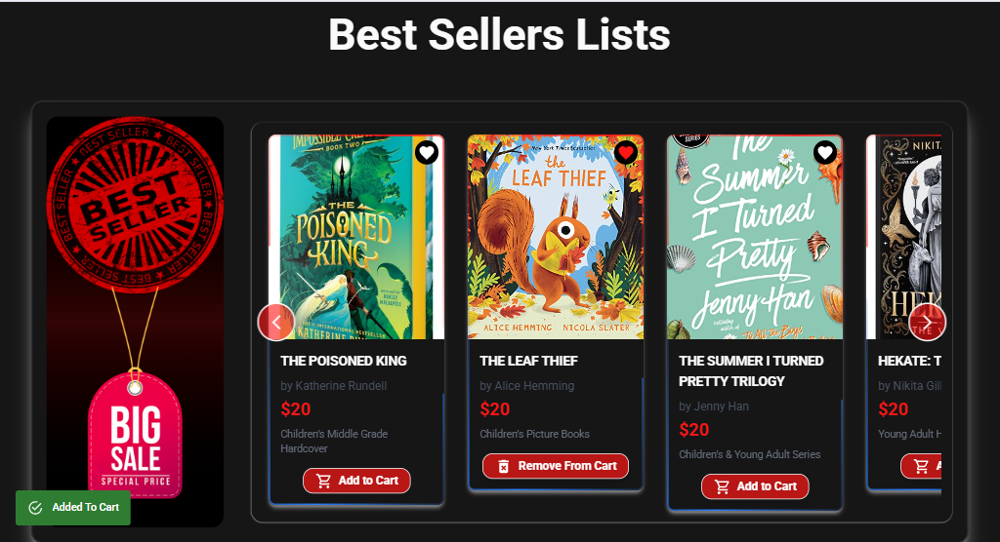

# 📚 NYT Books E-Commerce Platform

A modern, feature-rich e-commerce platform for browsing and purchasing books from The New York Times Best Sellers lists. Built with React, featuring a beautiful UI with smooth animations, dark mode support, and real-time data from the NYT Books API.




## 🌐 Live Demo

**[View Live Demo](https://ali-mohamed10.github.io/E-commerce-books/)**

## ✨ Features

### 📖 Core Features
- **Real-time NYT Best Sellers**: Fetches and displays the latest bestseller lists from The New York Times API
- **Smart Book Management**: Each book has a unique identifier (list + ISBN) to handle books appearing in multiple lists
- **Favorites System**: Save your favorite books across sessions with localStorage persistence
- **Shopping Cart**: Add books to cart with quantity controls and WhatsApp checkout integration
- **Advanced Filtering**: Search and filter books by title, author, and list category
- **Pagination**: Smooth pagination for browsing large book collections

### 🎨 UI/UX Features
- **Dark/Light Mode**: Seamless theme switching with next-themes
- **Smooth Animations**: Powered by Framer Motion for delightful user experience
- **Lazy Loading Images**: Optimized performance with lazy-loaded images
- **Responsive Design**: Fully responsive across all devices
- **Beautiful Components**: Custom UI components with Tailwind CSS and shadcn/ui
- **Toast Notifications**: Real-time feedback for user actions

### 🔐 Authentication
- **Clerk Integration**: Secure user authentication and management
- **Protected Routes**: Sign-in required for checkout functionality

## 🛠️ Technologies Used

### Frontend Framework & Libraries
- **React 19** - Latest React with modern features
- **Vite 7** - Lightning-fast build tool and dev server
- **React Router DOM 7** - Client-side routing with basename support for GitHub Pages

### Styling & UI
- **Tailwind CSS 4** - Utility-first CSS framework
- **Framer Motion 12** - Production-ready animation library
- **Material-UI (MUI)** - React component library for icons and UI elements
- **Styled Components** - CSS-in-JS styling
- **next-themes** - Perfect dark mode support

### State Management & Data
- **React Context API** - Global state management for books, favorites, and cart
- **Axios** - HTTP client for API requests
- **localStorage** - Client-side data persistence

### Authentication & Security
- **Clerk** - Complete user authentication solution

### Animations & Effects
- **canvas-confetti** - Celebration effects
- **OGL** - WebGL library for advanced graphics
- **Custom Animation Components** - Typewriter effects, scroll-based animations, background effects

### Development Tools
- **ESLint** - Code linting and quality
- **gh-pages** - Automated GitHub Pages deployment

## 📁 Project Structure

```
ecommerce-books/
├── public/
│   ├── icons8-book-96.png
│   └── Screenshot.png
├── src/
│   ├── assets/
│   │   └── imgs/
│   ├── components/
│   │   ├── common/          # Shared components
│   │   ├── layouts/         # Layout components (Navbar, Footer)
│   │   ├── magicui/         # Magic UI components
│   │   └── ui/              # Reusable UI components
│   ├── contexts/
│   │   ├── NytContext.jsx   # Books data management
│   │   └── ToastContext.jsx # Toast notifications
│   ├── pages/
│   │   ├── Home.jsx
│   │   ├── Categories.jsx
│   │   ├── BookDetails.jsx
│   │   ├── FavoriteBooks.jsx
│   │   ├── ShopCart.jsx
│   │   ├── About.jsx
│   │   └── Contact.jsx
│   ├── App.jsx
│   ├── main.jsx
│   └── index.css
├── package.json
├── vite.config.js
└── README.md
```

## 🚀 Getting Started

### Prerequisites
- Node.js (v18 or higher)
- npm or yarn

### Installation

1. **Clone the repository**
```bash
git clone https://github.com/Ali-mohamed10/E-commerce-books.git
cd E-commerce-books
```

2. **Install dependencies**
```bash
npm install
```

3. **Set up environment variables**
Create a `.env` file in the root directory:
```env
VITE_CLERK_PUBLISHABLE_KEY=your_clerk_publishable_key
```

4. **Run the development server**
```bash
npm run dev
```

5. **Open your browser**
Navigate to `http://localhost:5173`

## 📦 Build & Deploy

### Build for Production
```bash
npm run build
```

### Deploy to GitHub Pages
```bash
npm run deploy
```

## 🎯 Key Implementation Details

### Unique Book Identification
Each book is assigned a composite `uniqueId` combining the list name and ISBN:
```javascript
uniqueId: `${list.list_name_encoded}-${book.primary_isbn13}`
```
This ensures books appearing in multiple lists maintain separate states for favorites and cart.

### Data Persistence
- **localStorage**: Automatically saves and restores books data, favorites, and cart items
- **Auto-sync**: Data syncs every 60 seconds with the NYT API

### Performance Optimizations
- **Lazy Loading**: All images load on-demand
- **useMemo**: Expensive computations are memoized
- **Code Splitting**: React.lazy() for route-based code splitting

## 🌟 Features in Detail

### Shopping Cart
- Add/remove books
- Adjust quantities (minimum 1)
- Calculate total price
- WhatsApp integration for checkout

### Favorites
- Toggle favorite status
- Persist across sessions
- Dedicated favorites page

### Book Details
- Full book information
- Author and description
- Add to cart/favorites
- List category

## 🤝 Contributing

Contributions are welcome! Please feel free to submit a Pull Request.

## 📄 License

This project is open source and available under the [MIT License](LICENSE).

## 👨‍💻 Author

**Ali Mohamed**
- GitHub: [@Ali-mohamed10](https://github.com/Ali-mohamed10)
- Email: ali.dev400@gmail.com

## 🙏 Acknowledgments

- [The New York Times Books API](https://developer.nytimes.com/docs/books-product/1/overview)
- [Clerk](https://clerk.com/) for authentication
- [Tailwind CSS](https://tailwindcss.com/)
- [Framer Motion](https://www.framer.com/motion/)
- [shadcn/ui](https://ui.shadcn.com/) for component inspiration

---

⭐ If you found this project helpful, please give it a star!
